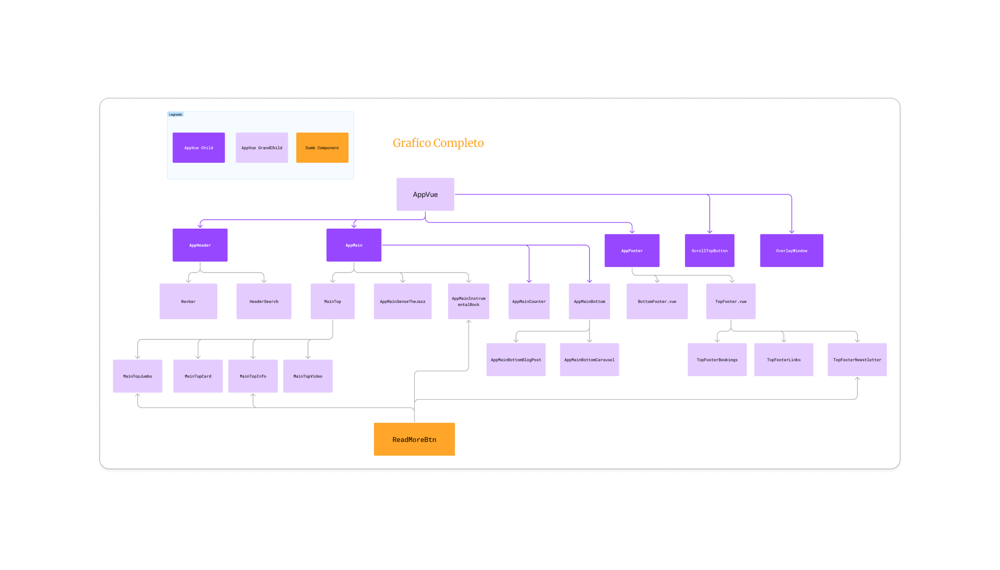

# Progetto Front-End Boolean

## Descrizione

Scaricando questa repository vedrete uno dei progetti realizzati durante i 6 mesi di corso Boolean in Full-Stack Web Development. In particolare questo progetto fu realizzato come finale della parte riguardante il Front-End. Si tratta di un possibile sito vetrina per un'azienda in ambito musicale. Piu avanti nella documentazione analizzeremo meglio le varie sezioni.

## Tecnologie Utilizzate
1. Vue.Js
2. HTML & CSS (with SASS)
3. Vanilla Javascript
4. Bootstrap

## Struttura
All'interno della cartella `src` troverete tutto il codice sorgente riguardante il progetto in tutte le sue parti.
Nel file `index.html` troverete soltanto il tag per imporate il div `app` e il file `main.js` che si occupa di gestire tutti gli `import` necessari per il funzionamento del progetto.
La cartella `src` ha la seguente struttura:
- La cartella *assets* dove sono contenuti tutti i file multimediali.
- La cartella *components* dove sono contenuti tutti i singoli componenti utilizzati nella pagina.
- La cartella *style* dove troverete a sua volta una sottocartella *partials* con poche informazioni (alcune variabili custom ed il resest CSS).
- Il file `App.vue` da cui parte tutto l-applicattivo
- Il file `main.js`

### Schema Componenti

I componenti principali, ovvero quelli importati direttamente nel file `App.vue` sono in questo ordine:
1. `AppHeader`
2. `AppMain`
3. `AppFooter`
4. `ScrollTopButton`
5. `OverlayWindow`

Tutti i restanti componenti presenti nella cartella sopra citata sono inseriti, a seconda del loro scopo, in uno o piu di questi componenti.

## AppHeader

All'interno del componente AppHeader abbiamo due sottocomponenti:
1. `Navbar`
2. `HeaderSearch`

Inoltre si nota come siano presenti i dati per il popolamento della navbar ovvero le voci che andranno a popolarla:
- Home
- Blog
- Events
    - Choral Music
    - Concert Band
    - Opera Concerts
    - Symphony Orchestra
    - Family Concerts
- Gallery
- About Us
- Contact Us
- Shop
    - Product Type
        - Simple Product
        - External/Affilate Product
        - Downloadable Product
        - Group Product
        - In-Stock Product
        - Variable Product
    - Shop Page
        - Checkout
        - Cart
        - Downloads
        - My Account

## AppMain

## AppFooter

## ScrollTopButton

## OverlayWinow